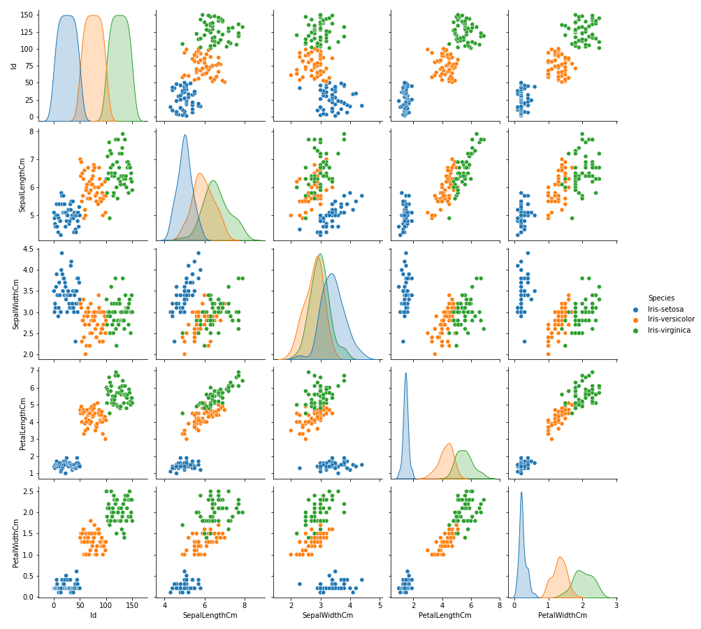
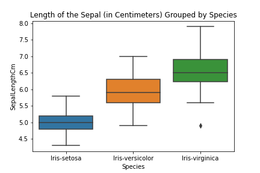
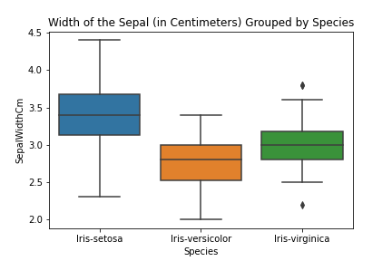
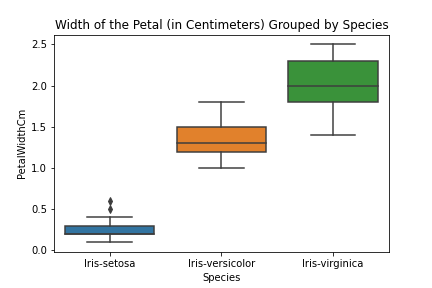
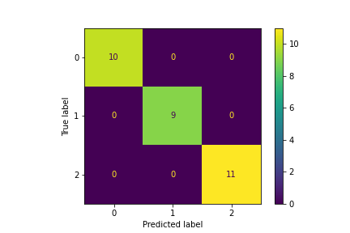

# Iris Species

1. [Importar librerías ](#schema1)
2. [Cargar los datos](#schema2)
3. [Visualización](#schema3)
4. [Procesamiento de datos](#schema4)

# 1. Importar librerías

~~~python
import numpy as np
import pandas as pd
import seaborn as sns
import os

from sklearn.preprocessing import LabelEncoder
from sklearn.svm import SVC
from sklearn.ensemble import RandomForestClassifier
from sklearn.model_selection import train_test_split
from sklearn.metrics import confusion_matrix
from sklearn.metrics import accuracy_score
from sklearn.metrics import zero_one_loss
from sklearn.metrics import multilabel_confusion_matrix
from sklearn.metrics import plot_confusion_matrix
from matplotlib import pyplot as plt
~~~

# 2. Cargar los datos
~~~python
df = pd.read_csv('/kaggle/input/iris/Iris.csv')
df.info()
<class 'pandas.core.frame.DataFrame'>
RangeIndex: 150 entries, 0 to 149
Data columns (total 6 columns):
 #   Column         Non-Null Count  Dtype  
---  ------         --------------  -----  
 0   Id             150 non-null    int64  
 1   SepalLengthCm  150 non-null    float64
 2   SepalWidthCm   150 non-null    float64
 3   PetalLengthCm  150 non-null    float64
 4   PetalWidthCm   150 non-null    float64
 5   Species        150 non-null    object 
dtypes: float64(4), int64(1), object(1)
memory usage: 7.2+ KB

df.isna().sum()

Id               0
SepalLengthCm    0
SepalWidthCm     0
PetalLengthCm    0
PetalWidthCm     0
Species          0
dtype: int64

df[['SepalLengthCm','SepalWidthCm','PetalLengthCm','PetalWidthCm']].describe()

SepalLengthCm	SepalWidthCm	PetalLengthCm	PetalWidthCm
count	150.000000	150.000000	150.000000	150.000000
mean	5.843333	3.054000	3.758667	1.198667
std	0.828066	0.433594	1.764420	0.763161
min	4.300000	2.000000	1.000000	0.100000
25%	5.100000	2.800000	1.600000	0.300000
50%	5.800000	3.000000	4.350000	1.300000
75%	6.400000	3.300000	5.100000	1.800000
max	7.900000	4.400000	6.900000	2.500000
~~~

# 3. Visualización
~~~python
sns.pairplot(df, hue = 'Species')
~~~

~~~python
sns.boxplot(x='Species', y='SepalLengthCm', data=df
           ).set_title("Length of the Sepal (in Centimeters) Grouped by Species")
~~~

~~~python
sns.boxplot(x='Species', y='SepalWidthCm', data=df
           ).set_title("Width of the Sepal (in Centimeters) Grouped by Species")
~~~

~~~python
sns.boxplot(x='Species', y='PetalLengthCm', data=df
           ).set_title("Length of the Petal (in Centimeters) Grouped by Species")
~~~

~~~python
sns.boxplot(x='Species', y='PetalWidthCm', data=df
           ).set_title("Width of the Petal (in Centimeters) Grouped by Species")
~~~

# 4. Procesamiento de datos

~~~python
X = df[['SepalLengthCm', 'SepalWidthCm', 'PetalLengthCm', 'PetalWidthCm']]
y = df['Species']
~~~

`LabelEncoder()` codifica etiquetas de una característica categórica en valores numéricos entre 0 y el número de clases menos 1. 
~~~python
encoder = LabelEncoder()
y = encoder.fit_transform(y)

[0 0 0 0 0 0 0 0 0 0 0 0 0 0 0 0 0 0 0 0 0 0 0 0 0 0 0 0 0 0 0 0 0 0 0 0 0
 0 0 0 0 0 0 0 0 0 0 0 0 0 1 1 1 1 1 1 1 1 1 1 1 1 1 1 1 1 1 1 1 1 1 1 1 1
 1 1 1 1 1 1 1 1 1 1 1 1 1 1 1 1 1 1 1 1 1 1 1 1 1 1 2 2 2 2 2 2 2 2 2 2 2
 2 2 2 2 2 2 2 2 2 2 2 2 2 2 2 2 2 2 2 2 2 2 2 2 2 2 2 2 2 2 2 2 2 2 2 2 2
 2 2]
X_train, X_test, y_train, y_test = train_test_split(X, y, test_size=0.20, random_state=42)
~~~

## Random Forest Classifier
~~~python
clf = RandomForestClassifier(max_depth=2, random_state=42)
clf.fit(X_train, y_train)
y_pred = clf.predict(X_test)
confusion_matrix(y_test, y_pred)
array([[10,  0,  0],
       [ 0,  9,  0],
       [ 0,  0, 11]])
~~~
Si normalize = False, devuelve el número de muestras clasificadas correctamente.

Aquí se clasificaron correctamente 30 muestras. Observe que hay un total de 30 muestras.
~~~python
accuracy_score(y_test, y_pred, normalize=False) 
30
~~~
Si es verdadero, devuelve la fracción de muestras clasificadas correctamente.

1.0 significa 100% de precisión del modelo.
~~~python
accuracy_score(y_test, y_pred, normalize=True) 
1
~~~

Si es falso, devuelve el número de clasificaciones erróneas.

Si es verdadero, devuelve la fracción de las clasificaciones erróneas.
~~~python
zero_one_loss(y_test, y_pred, normalize=False)
0
~~~

## Support Vector Classifier
~~~python
clf = SVC(gamma='auto')
clf.fit(X_train, y_train)
y_pred = clf.predict(X_test)
print('Model Accuracy: ', clf.score(X_train, y_train))
print('Number of Correctly Classified Samples: ', 
      accuracy_score(y_test, y_pred, normalize=False), 
      ' out of ', len(y_pred))
print('Number of Support Vectors for each Class: ', clf.n_support_)

Model Accuracy:  0.9916666666666667
Number of Correctly Classified Samples:  30  out of  30
Number of Support Vectors for each Class:  [ 6 18 19]
plot_confusion_matrix(clf, X_test, y_test)

~~~
